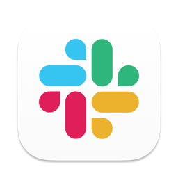
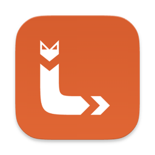

# 🐧 co-linux

> 새로 받은 우분투 PC 한 대를 명령어 한 줄로 co:code 팀 전체와 똑같은 개발환경으로 만들어주는 스크립트입니다.

[](https://ubuntu.com/)
[](./linux-setup.sh)
[](https://ubuntu.com/server/docs/package-management)

이 저장소에서 보실 파일은 딱 두 개입니다.

- [`linux-setup.sh`](./linux-setup.sh) — 개발환경을 자동으로 설치해주는 스크립트
- `README.md` — 지금 보고 계신 이 문서

> 💻 **맥북이나 윈도우 PC를 쓰신다면** 이 레포가 아니라 [coco-de/co-mac](https://github.com/coco-de/co-mac) 또는 [coco-de/co-win](https://github.com/coco-de/co-win)을 쓰세요. 세 레포는 **같은 도구 목록을 각자의 OS 방식으로** 설치합니다. 무엇이 어떻게 다른지는 [🍎 맥과 무엇이 다른가요](#vs-mac)에 정리해두었습니다.

## 목차

- [🙋 이런 분들을 위한 레포입니다](#who-is-this-for)
- [🚀 빠른 시작](#quickstart)
- [🧰 우리 팀의 기술 스택](#tech-stack)
- [📦 무엇이 설치되나요](#whats-installed)
- [🍎 맥과 무엇이 다른가요](#vs-mac)
- [✅ 설치 후 확인할 것](#after-install)
- [🔒 안전한가요](#is-it-safe)
- [🐛 문제가 생겼나요](#troubleshooting)
- [💬 도움이 필요하신가요](#get-help)

<br>

<a id="who-is-this-for"></a>

## 🙋 이런 분들을 위한 레포입니다

co:code는 엔지니어뿐 아니라 디자이너, PM도 하나의 엔지니어링 조직 아래에서 함께 일합니다. 그래서 **직군과 상관없이, 새로 합류한 모든 팀원이 이 스크립트 하나로 노트북을 세팅**합니다.

"나는 개발자가 아닌데 왜 개발환경 스크립트를 실행하지?" 라는 생각이 드신다면, 이렇게 이해해주시면 됩니다.

- 이 스크립트는 사실 여러 개의 앱과 도구를 하나씩 손으로 내려받아 설치하는 번거로운 과정을, 터미널(글자로 명령을 내리는 화면)에서 대신 자동으로 처리해주는 프로그램일 뿐입니다.
- Slack, Chrome처럼 직군에 관계없이 매일 쓰는 앱들도 이 스크립트가 함께 설치해 드립니다.
- 팀 전체의 노트북 환경이 같으면, 누가 무엇을 도와줄 때 "제 컴퓨터에서는 되는데요?" 같은 상황 없이 서로 빠르게 도와줄 수 있습니다.
- 프로그래밍을 잘 모르셔도 괜찮습니다. 아래 [빠른 시작](#quickstart)만 따라 하시면 됩니다. 실행 중에는 지금 무엇을 하고 있는지 화면에 계속 안내 문구가 표시됩니다.
- 스크립트 코드는 이 저장소의 [`linux-setup.sh`](./linux-setup.sh) 하나뿐이고, 전체가 공개되어 있어 누구나 열어서 무슨 일을 하는지 읽어볼 수 있습니다.

<br>

<a id="quickstart"></a>

## 🚀 빠른 시작

### 준비물

- **Ubuntu 22.04 LTS 이상 또는 Debian 12 이상이 설치된 PC. 이게 전부입니다.**
- 인텔·AMD(x86_64)와 ARM64 둘 다 됩니다.

개발 도구를 미리 깔아둘 필요가 없습니다. 우분투에 기본으로 들어 있는 앱 설치 관리자(`apt`)를 스크립트가 그대로 활용하고, 필요한 저장소는 알아서 등록합니다.

> 💡 **apt가 뭔가요?** 맥의 Homebrew, 윈도우의 winget에 해당하는 우분투 공식 앱 설치 관리자입니다. 이 스크립트가 설치하는 대부분의 도구는 apt를 통해 내려받아집니다.

> 💡 **snap은 뭔가요?** apt 저장소에 없거나 버전이 뒤처지는 앱(Android Studio·Slack 등)을 우분투가 공식으로 배포하는 또 다른 방식입니다. 우분투에는 기본으로 들어 있고, 없으면 스크립트가 설치합니다.

### 실행

터미널을 열고 (**Ctrl + Alt + T**), 아래 한 줄을 붙여넣은 뒤 Enter를 누르세요.

```bash
d="$(mktemp -d)" && curl -fsSL https://raw.githubusercontent.com/coco-de/co-linux/main/linux-setup.sh -o "$d/linux-setup.sh" && bash "$d/linux-setup.sh"
```

> 💡 **맥(co-mac)과 명령 모양이 다릅니다.** 맥에서 쓰는 `bash -c "$(curl ...)"` 형태는 리눅스에서 동작하지 않습니다 — 리눅스 커널은 **인자 하나의 크기를 128KiB로 제한**하는데(`MAX_ARG_STRLEN`) 이 스크립트가 그보다 커서 `Argument list too long` 으로 실행 자체가 막힙니다. 그래서 임시 폴더로 받아 실행합니다.

> ⏱ **설치에는 30분~2시간 정도 걸립니다.** Android SDK가 수 GB짜리이고 pyenv가 파이썬을 소스에서 직접 빌드해서, 네트워크·CPU 속도에 따라 차이가 큽니다. 중간에 창을 닫지 마시고, 다른 일을 하셔도 됩니다.

> 🔐 **중간에 암호를 한 번 물어봅니다.** 앱 설치에 관리자 권한이 필요해서입니다. 로그인할 때 쓰는 그 암호를 입력하시면 됩니다. (입력해도 화면에 아무 글자도 안 보이는 게 정상입니다.)

<details>
<summary>레포를 clone해서 실행하고 싶다면 (권장)</summary>

<br>

```bash
sudo apt update && sudo apt install -y git
git clone https://github.com/coco-de/co-linux.git
cd co-linux
chmod +x linux-setup.sh
./linux-setup.sh
```

**clone 쪽이 한 줄 실행보다 나은 점이 하나 있습니다.** 기존에 쓰던 PC(맥 포함)의 `~/.zshrc`·`~/.p10k.zsh`를 이 폴더에 복사해 두면, 스크립트가 레포의 기본 설정 대신 **그 파일을 그대로 씁니다.** 터미널 테마와 개인 별칭을 그대로 옮겨올 수 있습니다. 한 줄 실행에는 "옆 폴더"라는 개념이 없어서 이 기능을 쓸 수 없습니다.

</details>

<details>
<summary>⚠️ sudo로 실행해야 하나요? (짧은 답: 아니요)</summary>

<br>

**`sudo ./linux-setup.sh` 로 실행하지 마세요.** 스크립트 전체를 관리자로 돌리면 fvm·`dart pub global`·nvm·pyenv가 설치한 것들이 전부 `/root` 폴더에 깔려서, 정작 평소 쓰는 터미널에서는 아무것도 안 보이는 2차 사고가 납니다.

그냥 `./linux-setup.sh` 로 실행하세요. 관리자 권한이 **필요한 순간에만** 스크립트가 암호를 물어봅니다. 암호를 입력할 수 없는 환경이라면 그 단계들은 **명령어와 함께 방법만 안내하고 건너뜁니다.**

</details>

### 다시 실행할 때 쓰는 옵션

모든 단계는 **몇 번을 실행해도 안전**합니다(이미 설치된 건 건너뜁니다). 특정 부분만 다시 하고 싶을 때는 아래 옵션을 쓰세요.

| 옵션 | 하는 일 |
|---|---|
| (없음) | 전체 설치 (0~10단계) |
| `--env-only` | 1Password에서 팀 공용 토큰만 다시 읽어 `~/.zshrc`에 주입 |
| `--dart-only` | Dart 글로벌 패키지만 다시 설치/업데이트 |
| `--system-only` | 관리자 권한이 필요한 설정(docker·kvm 그룹, Android 기기 인식 규칙)만 다시 점검 |
| `-h`, `--help` | 사용법 표시 |

> 💡 한 줄 실행에서도 옵션은 그냥 뒤에 붙이면 됩니다 — `bash "$d/linux-setup.sh" --dart-only` 처럼요.
> (clone 해서 쓰신다면 `./linux-setup.sh --dart-only` 로 똑같이 쓰시면 됩니다.)

<br>
<a id="tech-stack"></a>

## 🧰 우리 팀의 기술 스택

`linux-setup.sh` 하나로 co:code 팀 전체 PC에 실제로 세팅되는 앱·CLI·언어 런타임을 한눈에 모았습니다. 아이콘은 대부분 [Simple Icons](https://simpleicons.org)에서 받아 이 저장소의 [`assets/icons/`](./assets/icons)에 함께 보관하고 있습니다. Simple Icons에 없는 앱·도구는 실제 브랜드 아이콘을 받아 사용했고, 공식 브랜드 아이콘이 아직 없는 도구는 이름만 표기했습니다 (자세한 목록은 아래 표 끝의 각주 참고).

<br>

**📦 패키지 관리자** — 아래 도구 대부분이 이걸 통해 설치됩니다. 우분투에 기본으로 들어 있습니다.

<table>
<tr>
<td align="center" width="100"><br><sub><b>apt</b></sub></td>
<td align="center" width="100"><br><sub><b>snap</b><br>(보조)</sub></td>
<td align="center" width="100"></td>
<td align="center" width="100"></td>
<td align="center" width="100"></td>
</tr>
</table>

**🖥 GUI 앱**

<table>
<tr>
<td align="center" width="100"><br><sub><b>Android Studio</b></sub></td>
<td align="center" width="100"><br><sub><b>Slack</b></sub></td>
<td align="center" width="100"><br><sub><b>Claude Desktop</b></sub></td>
<td align="center" width="100"><br><sub><b>Google Chrome</b></sub></td>
<td align="center" width="100"><br><sub><b>1Password</b></sub></td>
</tr>
<tr>
<td align="center" width="100"><br><sub><b>Tailscale</b></sub></td>
<td align="center" width="100"><br><sub><b>Orca</b></sub></td>
<td align="center" width="100"><br><sub><b>Lumide</b></sub></td>
<td align="center" width="100"><br><sub><b>Zed</b></sub></td>
<td align="center" width="100"><sub><b>btop</b><br>(Stats 대체)</sub></td>
</tr>
<tr>
<td align="center" width="100"><sub><b>Pretendard</b><br>(폰트)</sub></td>
<td align="center" width="100"></td>
<td align="center" width="100"></td>
<td align="center" width="100"></td>
<td align="center" width="100"></td>
</tr>
</table>

**🛠 CLI 도구**

<table>
<tr>
<td align="center" width="100"><br><sub><b>git</b></sub></td>
<td align="center" width="100"><br><sub><b>go</b></sub></td>
<td align="center" width="100"><br><sub><b>pyenv</b></sub></td>
<td align="center" width="100"><br><sub><b>nvm</b></sub></td>
<td align="center" width="100"><br><sub><b>gh</b></sub></td>
<td align="center" width="100"><sub><b>jq</b><br>(JSON 처리)</sub></td>
</tr>
<tr>
<td align="center" width="100"><sub><b>awscli</b></sub></td>
<td align="center" width="100"><br><sub><b>Docker Engine</b><br>(네이티브)</sub></td>
<td align="center" width="100"><sub><b>direnv</b></sub></td>
<td align="center" width="100"><br><sub><b>lefthook</b><br>(Git 훅)</sub></td>
<td align="center" width="100"><br><sub><b>JDK 17</b><br>(OpenJDK)</sub></td>
<td align="center" width="100"><sub><b>KVM</b><br>(에뮬레이터 가속)</sub></td>
</tr>
<tr>
<td align="center" width="100"><br><sub><b>Claude Code</b></sub></td>
<td align="center" width="100"><br><sub><b>codex</b><br>(OpenAI)</sub></td>
<td align="center" width="100"><br><sub><b>agy</b><br>(Antigravity)</sub></td>
<td align="center" width="100"><br><sub><b>slack</b><br>(Slack CLI)</sub></td>
<td align="center" width="100"><br><sub><b>op</b><br>(1Password CLI)</sub></td>
<td align="center" width="100"><br><sub><b>ccstatusline</b><br>(상태줄)</sub></td>
</tr>
</table>

**💙 Flutter · Dart**

<table>
<tr>
<td align="center" width="100"><br><sub><b>Flutter</b><br>(stable)</sub></td>
<td align="center" width="100"><br><sub><b>Dart</b></sub></td>
<td align="center" width="100"><br><sub><b>fvm</b><br>(버전 관리)</sub></td>
<td align="center" width="100"><br><sub><b>melos</b><br>(모노레포)</sub></td>
<td align="center" width="100"><br><sub><b>mason_cli</b><br>(코드 생성)</sub></td>
<td align="center" width="100"><br><sub><b>cob</b><br>(co-bricks)</sub></td>
</tr>
<tr>
<td align="center" width="100"><br><sub><b>serverpod_cli</b><br>(백엔드)</sub></td>
<td align="center" width="100"><br><sub><b>jaspr_cli</b><br>(웹)</sub></td>
<td align="center" width="100"><br><sub><b>flutter_gen</b><br>(에셋)</sub></td>
<td align="center" width="100"><br><sub><b>flutterfire_cli</b></sub></td>
<td align="center" width="100"><br><sub><b>coverage</b><br>(테스트)</sub></td>
<td align="center" width="100"><sub><b>DCM</b><br>(코드 품질)</sub></td>
</tr>
<tr>
<td align="center" width="100"><br><sub><b>marionette_mcp</b></sub></td>
<td align="center" width="100"><br><sub><b>mcp_server_dart</b></sub></td>
<td align="center" width="100"><br><sub><b>Android SDK</b><br>+ NDK · AVD</sub></td>
<td align="center" width="100"></td>
<td align="center" width="100"></td>
<td align="center" width="100"></td>
</tr>
</table>

**☁️ 클라우드 · 런타임**

<table>
<tr>
<td align="center" width="100"><br><sub><b>gcloud</b></sub></td>
<td align="center" width="100"><br><sub><b>Python 3.x</b></sub></td>
<td align="center" width="100"><br><sub><b>Node.js LTS</b></sub></td>
<td align="center" width="100"><br><sub><b>npm</b></sub></td>
<td align="center" width="100"></td>
</tr>
</table>

**⌨️ 터미널 환경**

<table>
<tr>
<td align="center" width="100"><br><sub><b>zsh</b></sub></td>
<td align="center" width="100"><br><sub><b>oh-my-zsh</b></sub></td>
<td align="center" width="100"><sub><b>powerlevel10k</b><br>(프롬프트)</sub></td>
<td align="center" width="100"><br><sub><b>GNOME Terminal</b><br>(폰트 자동 적용)</sub></td>
<td align="center" width="100"><sub><b>MesloLGS NF</b><br>(폰트)</sub></td>
</tr>
</table>

<sub>※ 아이콘 출처 — 대부분 [Simple Icons](https://simpleicons.org). Simple Icons에 없어 실제 브랜드 아이콘을 사용한 것: Orca·Lumide·Slack·codex·Antigravity. 공식 아이콘이 없어 이름만 표기한 것: jq · awscli · direnv · btop · KVM · Pretendard · DCM · powerlevel10k · MesloLGS NF. Dart 생태계 CLI(fvm·melos·mason_cli·jaspr_cli·serverpod_cli·flutter_gen·coverage·cob·marionette_mcp·mcp_server_dart)는 Dart 아이콘을 공용으로 사용합니다.</sub>

<br>
<a id="whats-installed"></a>

## 📦 무엇이 설치되나요

스크립트는 아래 순서대로 진행합니다. 화면에 `▶ 3. CLI 도구 설치` 처럼 지금 어느 단계인지 계속 표시됩니다.

| 단계 | 하는 일 |
|---|---|
| **0** | apt 기반 구성 — 빌드 필수 패키지, Flutter 리눅스 데스크톱 빌드 의존성, 에뮬레이터 라이브러리 |
| **0.5** | 팀 셸 설정(`.zshrc`·`.p10k.zsh`) 확보 |
| **1** | GUI 앱 — Android Studio · Slack · Chrome · 1Password · Tailscale · Orca · Lumide · Zed · Claude Desktop · btop |
| **1.6** | Chrome 확장 자동 등록 (ZenHub for GitHub) |
| **1.7** | Pretendard 폰트 9개 스타일 |
| **1.8** | 1Password CLI(`op`) — 화면 없는 환경에서 1단계를 건너뛴 경우에만 동작 |
| **2** | Claude Code CLI |
| **2.5** | Claude MCP 서버 등록 — figma · zenhub · jira(mcp-atlassian) · slack |
| **2.6** | 다른 AI 코딩 CLI — codex(OpenAI) · agy(Google Antigravity) |
| **2.7** | Slack CLI |
| **3** | CLI 도구 — go · git · gh · jq · docker · direnv · JDK 17 · awscli · lefthook |
| **3.2** | Git 사용자 이메일 설정 |
| **3.3** | Chrome 번역 언어 자동 설정 (한국어) |
| **3.4** | GitHub 인증 자동화 (1Password 팀 토큰 → `gh auth login`) |
| **3.5** | cocode-skills 팀 플러그인 |
| **4** | Flutter/Dart(fvm) · Dart 글로벌 패키지 · gcloud · DCM · Android SDK/AVD |
| **5** | Python (pyenv로 최신 3.x) |
| **6** | Node.js (nvm으로 LTS) |
| **6.1** | codex 재설치 시도 — 2.6단계는 Node.js보다 앞이라 그때 건너뛰었기 때문 |
| **6.5** | Claude Code 상태줄 (ccstatusline) |
| **7** | oh-my-zsh + powerlevel10k |
| **7.5** | 터미널 폰트 자동 적용 (MesloLGS NF) |
| **8** | `~/.zshrc`·`~/.p10k.zsh` 반영 + 기본 셸을 zsh로 변경 |
| **8.5~8.9** | 팀 공용 토큰 5종 주입 (ZenHub · Jira · slang_gpt · DCM · Slack) |
| **9** | 시스템 권한 — docker·kvm 그룹 가입, Android 기기 인식 규칙 |
| **10** | 설치 검증 + 다음 단계 안내 |

<details>
<summary><b>도구별 상세 설명 펼쳐보기</b></summary>

<br>

### 🖥 GUI 앱

| | 도구 | 용도 |
|---|---|---|
|  | **Android Studio** | 안드로이드 앱 개발 IDE · 에뮬레이터 관리 (`snap install android-studio --classic`) |
|  | **Slack** | 팀 커뮤니케이션 (`snap install slack`) |
|  | **Google Chrome** | 팀 표준 브라우저 · Flutter 웹 디버깅 (공식 apt 저장소) |
|  | **Claude Desktop** | Claude 데스크톱 앱 (공식 apt 저장소 · 2026년 6월부터 리눅스 정식 베타) |
|  | **1Password** + `op` | 팀 공용 비밀번호·토큰 금고. `op`(CLI)는 3.4·8.5~8.9단계가 토큰을 읽는 데 씁니다 (공식 apt 저장소) |
|  | **Tailscale** | 팀 내부망 VPN (공식 설치 스크립트) |
|  | **Orca** | 여러 AI 에이전트를 동시에 돌리는 개발 환경 (GitHub 릴리스 AppImage) |
|  | **Lumide** | 에이전트 친화 경량 코드 에디터 |
|  | **Zed** | 고성능 코드 에디터 (공식 설치 스크립트 → `~/.local/bin`) |
| | **btop** | 터미널에서 CPU·메모리·디스크·네트워크를 보는 시스템 모니터 (맥의 Stats 대체) |
| | **Pretendard** | 팀 표준 한글 폰트 9개 스타일 (`~/.local/share/fonts`) |

### 🛠 CLI 도구

| | 도구 | 용도 |
|---|---|---|
|  | **git** | 버전 관리 (`apt install git`) |
|  | **go** | Go 언어 (`apt install golang-go`) |
|  | **pyenv** | 파이썬 버전 관리 (공식 설치 스크립트 · 파이썬을 **소스에서 빌드**하므로 시간이 걸립니다) |
|  | **nvm** | Node.js 버전 관리 (공식 설치 스크립트) |
|  | **gh** | GitHub CLI — PR·이슈 조작, 3.4단계 자동 로그인 (공식 apt 저장소) |
| | **jq** | JSON 처리 — 3.3단계 브라우저 설정 편집에도 씁니다 (`apt install jq`) |
| | **awscli** | AWS 명령줄 도구 (공식 zip 설치본 v2) |
|  | **Docker Engine** | 컨테이너 실행 — Jira MCP가 이걸로 뜹니다 (공식 apt 저장소 · **리눅스는 네이티브라 colima가 필요 없습니다**) |
| | **direnv** | 폴더별 환경변수 자동 적용 (`apt install direnv`) |
|  | **lefthook** | 커밋·푸시 직전 포맷/린트/테스트 자동 실행 (레포마다 최초 1회 `lefthook install` 필요) |
|  | **JDK 17** | 안드로이드 빌드·`sdkmanager` 구동 (`apt install openjdk-17-jdk`) |
| | **KVM** | 안드로이드 에뮬레이터 하드웨어 가속 (맥의 HVF, 윈도우의 WHPX에 해당) |
|  | **Claude Code** | AI 코딩 CLI (공식 설치 스크립트) |
|  | **codex** | OpenAI 코딩 CLI (`npm install -g @openai/codex` · ⚠ Node 설치 후에 깔립니다) |
|  | **agy** | Google Antigravity CLI |
|  | **slack** | Slack 앱·워크플로 개발 CLI |
|  | **ccstatusline** | Claude Code 터미널 상태줄 |

### 💙 Flutter · Dart

| | 도구 | 용도 |
|---|---|---|
|  | **Flutter (stable)** | fvm으로 설치·관리 |
|  | **fvm** | Flutter 버전 관리 (공식 설치 스크립트) |
|  | **melos** | 모노레포 패키지 관리 |
|  | **mason_cli** | 코드 템플릿(brick) 생성 |
|  | **cob** | co:code 전용 brick 도구 (`coco-de/co-bricks` — **비공개 레포라 GitHub 인증 필요**) |
|  | **serverpod_cli** | Serverpod 백엔드 (`^4.0.0-beta.4`) |
|  | **jaspr_cli** | Dart 웹 프레임워크 |
|  | **flutter_gen** | 에셋·폰트 코드 생성 |
|  | **flutterfire_cli** | Firebase 연동 설정 |
|  | **coverage** | 테스트 커버리지 측정 |
| | **DCM** | Dart 코드 품질 분석 (공식 apt 저장소) |
|  | **marionette_mcp** / **mcp_server_dart** | Flutter 앱 제어·MCP 서버 |
|  | **Android SDK** | cmdline-tools · platform-tools · build-tools · NDK · 시스템 이미지 · AVD |

### ☁️ 클라우드 · 런타임 · 터미널

| | 도구 | 용도 |
|---|---|---|
|  | **gcloud** | Google Cloud CLI (공식 apt 저장소) |
|  | **Python 3.x** | pyenv로 최신 3.x |
|  | **Node.js LTS** | nvm으로 LTS (npm 포함) |
|  | **zsh** + **oh-my-zsh** | 팀 표준 셸 (스크립트가 기본 셸로 바꿔줍니다) |
| | **powerlevel10k** | zsh 프롬프트 테마 |
|  | **MesloLGS NF** | powerlevel10k 아이콘용 폰트 — GNOME Terminal이면 자동 적용 |

</details>

<br>
<a id="vs-mac"></a>

## 🍎 맥과 무엇이 다른가요

[co-mac](https://github.com/coco-de/co-mac)·[co-win](https://github.com/coco-de/co-win)과 **같은 도구 목록을 각자의 OS 방식으로** 설치합니다. Flutter 개발에 필요한 것은 전부 갖춰지며, 팀 표준 셸 설정(`.zshrc`·`.p10k.zsh`)도 그대로 씁니다.

### ✅ 리눅스가 더 나은 것

윈도우 이식 때 문제였던 것들이 리눅스에서는 오히려 맥보다 깔끔하게 풀립니다.

| 항목 | 맥 | 리눅스 |
|---|---|---|
| **Docker** | `colima`로 리눅스 VM을 띄워야 도커 데몬이 뜸 | **네이티브로 실행** — VM이 필요 없어 메모리·시작 시간이 절약되고, `colima start`를 잊어 Jira MCP가 끊기는 일도 없습니다 |
| **에뮬레이터 가속** | HVF (자동) | **KVM** — 커널에 내장돼 있어 별도 설치가 거의 없습니다 |
| **cocode-skills 팀 플러그인** | `rsync` 사용 | **동일하게 동작** — `rsync`가 기본 내장이라 윈도우에서 막혔던 문제가 없습니다 |
| **긴 경로 / 심볼릭 링크** | 문제 없음 | 문제 없음 — 윈도우처럼 260자 제한이나 개발자 모드 설정이 필요 없습니다 |

### 🔄 다르게 하는 것 (대체 수단 있음)

| 맥에서는 | 리눅스에서는 | 이유 |
|---|---|---|
| Homebrew | **apt + snap** | 우분투 기본 패키지 관리자를 씁니다. Homebrew on Linux는 500MB 추가 레이어에 소스 빌드가 잦아 쓰지 않습니다 |
| Terminal.app 폰트 자동 설정 (`osascript`) | **GNOME Terminal `gsettings`** | 데스크톱 환경이 다릅니다. GNOME이 아니면 수동 설정 안내로 대체합니다 |
| Stats (메뉴막대 모니터) | **btop** | Stats는 macOS 전용입니다. btop이 같은 정보를 터미널에서 보여줍니다 |
| `~/Library/Android/sdk` | **`~/Android/Sdk`** | 리눅스 Android Studio의 표준 SDK 경로입니다 |
| `openjdk@17` (brew 고정 경로) | **`/usr/lib/jvm/java-17-openjdk-<arch>`** | 아키텍처(amd64·arm64)마다 경로가 달라 `.zshrc`가 실제 있는 것을 찾아 씁니다 |
| Orca (brew cask) | **AppImage** | 리눅스판은 AppImage로 배포됩니다. `.desktop` 항목도 함께 만들어 앱 목록에 나옵니다 |
| Full Disk Access 권한 (9단계) | **docker·kvm 그룹 가입 + udev 규칙** | macOS 권한 모델이 리눅스에 없습니다. 대신 리눅스에서 실제로 필요한 권한을 잡습니다 |

### ❌ 빠진 것 (리눅스에서 불가능)

| 맥에 있는 것 | 왜 없나 | 대안 |
|---|---|---|
| **Xcode · iOS 빌드** | Apple 툴체인은 macOS에서만 동작합니다 | **iOS 빌드·배포는 맥이 필요합니다.** 안드로이드·웹·리눅스 데스크톱 빌드는 전부 됩니다 |
| **CocoaPods** | iOS 의존성 관리 도구입니다 | 위와 같음 |
| **fastlane** | 팀에서는 주로 iOS 배포에 씁니다 | 안드로이드 배포만 필요하면 `gem install fastlane`으로 직접 설치할 수 있습니다 |
| **Figma 데스크톱 앱** | 리눅스 빌드가 없습니다 | [figma.com](https://figma.com) 웹에서 동일하게 사용 (기능 차이 없음) |
| **Rive 데스크톱 앱** | 리눅스 빌드가 없습니다 | [editor.rive.app](https://editor.rive.app) 웹 에디터 — 공식 문서상 데스크톱과 기능이 같습니다 |
| **Dia 브라우저** | 리눅스 빌드가 없습니다 | Chrome을 씁니다 |
| **mas (App Store CLI)** | App Store가 없습니다 | apt·snap이 그 역할을 합니다 |

> ⚠️ **iOS 개발이 업무에 포함된다면 리눅스 PC만으로는 부족합니다.** Flutter 앱의 iOS 빌드·시뮬레이터·App Store 배포는 macOS에서만 가능하므로, 맥이 별도로 필요합니다.

### 🤔 일부러 하지 않은 것

| 항목 | 왜 |
|---|---|
| **WSL 전용 분기** | WSL 사용자는 [co-win](https://github.com/coco-de/co-win)을 씁니다. 두 경로를 한 스크립트가 떠안으면 양쪽 다 검증이 어려워집니다 |
| **Fedora·Arch 지원** | 패키지명·저장소가 전부 달라 스크립트가 3배로 복잡해집니다. 다른 배포판에서 실행하면 경고만 하고 되는 것까지는 진행합니다 |
| **Homebrew on Linux** | 맥 포뮬러를 1:1로 재사용할 수 있지만, 500MB 추가 레이어와 잦은 소스 빌드로 설치가 크게 느려집니다 |
| **flatpak** | 우분투 기본은 snap입니다. 둘을 함께 쓰면 설정이 한 겹 늘고 Android Studio 연동이 까다로워집니다 |
| **스크립트 전체를 sudo로 실행** | fvm·pub·nvm·pyenv 설치물이 `/root`에 깔려 평소 터미널에서 안 보이게 됩니다. 필요할 때만 암호를 물어봅니다 |

<br>
<a id="after-install"></a>

## ✅ 설치 후 확인할 것

스크립트가 끝나면 마지막에 설치 검증 결과를 보여줍니다. 이런 모양입니다.

```
▶ 10. 설치 검증

  ✓ zsh          5.9
  ✓ git          2.43.0
  ✓ gh           2.62.0 (인증됨: coco-de-dev)
  ✓ docker       27.3.1  ⚠ 그룹 반영을 위해 재로그인 필요
  ✓ go           1.22.2
  ✓ java         17.0.13
  ✓ fvm/flutter  3.27.1
  ✓ dart         3.6.0 (글로벌 패키지 10/10)
  ✓ gcloud       503.0.0
  ✓ node         v22.11.0 / npm 10.9.0
  ✓ python       3.13.1 (pyenv)
  ✓ adb          35.0.2
  ✓ AVD          Pixel_7_API_35
  ❌ dcm         → 수동 설치: https://dcm.dev/docs/getting-started/
```

`❌`가 있으면 그 줄에 적힌 수동 설치 명령을 실행하시면 됩니다. 하나 실패해도 나머지는 정상 설치된 상태입니다.

### ⚠️ 반드시 해야 하는 후속 작업

| 순서 | 할 일 | 왜 |
|---|---|---|
| **1** | **로그아웃 후 다시 로그인** (또는 재부팅) | docker·kvm **그룹 가입**과 **기본 셸 변경(zsh)** 은 새 로그인 세션부터 적용됩니다. 이걸 안 하면 `docker ps`가 `permission denied`로 실패하고 터미널도 bash 그대로입니다 |
| **2** | 터미널 폰트를 **MesloLGS NF** 로 | GNOME Terminal이면 자동 적용됩니다. 다른 터미널이면 설정에서 직접 골라주세요. 안 하면 프롬프트 아이콘이 네모(□)로 깨집니다 |
| **3** | `p10k configure` | 프롬프트 모양을 취향대로 (선택) |
| **4** | 레포마다 최초 1회 `lefthook install` | 커밋 훅은 레포별로 등록해야 동작합니다 |
| **5** | 1Password 연동이 안 됐다면 → 켠 뒤 `./linux-setup.sh --env-only` | 팀 공용 토큰(ZenHub·Jira 등) 주입이 건너뛰어졌을 수 있습니다 |

<details>
<summary>1Password CLI(op) 연동하는 법</summary>

<br>

3.4단계(GitHub 자동 로그인)와 8.5~8.9단계(팀 토큰 주입)는 1Password에서 값을 읽어옵니다. 연동이 안 돼 있으면 그 단계들이 건너뛰어집니다.

1. 1Password 앱을 열고 팀 계정(`team-cocodeinc.1password.com`)으로 로그인
2. **설정 > 개발자 > "1Password CLI와 통합"** 체크
3. 터미널에서 확인:
   ```bash
   op account list        # 팀 계정이 보이면 성공
   ```
4. 다시 실행:
   ```bash
   ./linux-setup.sh --env-only
   ```

> 맥에서는 Touch ID를 함께 켜야 하지만, 리눅스에는 그 항목이 없습니다. 개발자 탭의 CLI 통합만 켜면 됩니다.

</details>

<br>

<a id="is-it-safe"></a>

## 🔒 안전한가요

- **스크립트 전체가 공개돼 있습니다.** [`linux-setup.sh`](./linux-setup.sh) 하나뿐이고, 무엇을 설치하는지 한국어 주석으로 전부 적혀 있습니다.
- **비밀번호·토큰을 이 저장소에 저장하지 않습니다.** 팀 공용 토큰은 실행 시점에 **1Password에서 직접 읽어옵니다.** 저장소에는 "어느 항목을 읽을지"(`op://API Token/...`)만 적혀 있고 값은 없습니다.
- **GitHub 토큰은 파일로 떨어뜨리지 않습니다.** 메모리 파이프로만 `gh`에 넘기고, 쓰고 나면 바로 변수에서 지웁니다(`unset`).
- **관리자 권한은 필요한 순간에만** 요청합니다. 스크립트 전체를 `sudo`로 돌리지 않습니다.
- **몇 번을 실행해도 안전합니다.** 이미 설치된 것은 건너뛰고, 설정 파일도 같은 내용을 중복해서 덧붙이지 않습니다.
- **하나가 실패해도 멈추지 않습니다.** 경고를 남기고 다음 단계로 넘어가므로, 한 도구 때문에 나머지가 통째로 안 깔리는 일이 없습니다.

<br>

<a id="troubleshooting"></a>

## 🐛 문제가 생겼나요

<details>
<summary><code>docker: permission denied</code> 가 뜹니다</summary>

<br>

docker 그룹 가입이 **아직 세션에 반영되지 않은** 상태입니다. 그룹 변경은 새 로그인 세션부터 적용됩니다.

```bash
id -nG | tr ' ' '\n' | grep docker    # docker 가 보이면 가입은 된 상태
```

보인다면 **로그아웃 후 다시 로그인**하면 해결됩니다. 안 보인다면:

```bash
./linux-setup.sh --system-only
```

</details>

<details>
<summary>터미널 프롬프트에 네모(□)나 물음표가 보입니다</summary>

<br>

MesloLGS NF 폰트가 터미널에 적용되지 않은 상태입니다. 폰트 파일 자체는 `~/.local/share/fonts`에 설치돼 있습니다.

- **GNOME Terminal**: 메뉴 > 기본 설정 > (프로필 선택) > 텍스트 > "시스템 고정폭 글꼴 사용" 끄기 → **MesloLGS NF** 선택
- **다른 터미널**: 설정에서 글꼴을 `MesloLGS NF` 로 지정

폰트 목록에 안 보이면 캐시를 다시 만들어 주세요.

```bash
fc-cache -f && fc-list | grep -i meslo
```

</details>

<details>
<summary>안드로이드 에뮬레이터가 아주 느립니다</summary>

<br>

KVM 하드웨어 가속이 꺼져 있을 때 그렇습니다. 확인:

```bash
ls -l /dev/kvm                        # 파일이 없으면 BIOS 설정 문제
id -nG | tr ' ' '\n' | grep kvm       # 비어 있으면 그룹 가입 문제
```

- `/dev/kvm`이 **없으면**: PC를 재부팅해 BIOS/UEFI에서 가상화(**Intel VT-x** 또는 **AMD-V/SVM**)를 켜주세요.
- **그룹에 없으면**: `./linux-setup.sh --system-only` 실행 후 재로그인.
- **ARM64 PC라면**: 구글이 ARM64 리눅스용 x86 시스템 이미지를 제공하지 않습니다. 스크립트가 `arm64-v8a` 이미지를 골라 설치하므로 그대로 쓰시면 됩니다.

</details>

<details>
<summary><code>cob</code>(co-bricks)가 설치되지 않았습니다</summary>

<br>

`coco-de/co-bricks`는 **비공개 레포**라 GitHub 인증이 필요합니다. 3.4단계가 1Password로 자동 로그인을 시도하지만, 연동이 안 돼 있으면 건너뜁니다.

```bash
gh auth status              # 인증 상태 확인
gh auth login               # 수동 로그인 (브라우저로 진행)
gh auth setup-git           # ★ 이걸 빼먹으면 git이 계속 인증을 물어봅니다
./linux-setup.sh --dart-only
```

</details>

<details>
<summary>Python(pyenv) 설치가 실패하거나 아주 오래 걸립니다</summary>

<br>

pyenv는 파이썬을 **소스에서 직접 빌드**합니다(수 분~십수 분). 빌드 의존성이 빠지면 조용히 반쪽짜리로 끝나기도 합니다. 스크립트가 5단계에서 필요한 패키지를 함께 깔지만, 실패했다면 직접:

```bash
sudo apt install -y libssl-dev zlib1g-dev libbz2-dev libreadline-dev libsqlite3-dev \
  libncursesw5-dev tk-dev libxml2-dev libxmlsec1-dev libffi-dev liblzma-dev
pyenv install 3.13.1
```

</details>

<details>
<summary>스크립트가 중간에 멈춘 것처럼 보입니다</summary>

<br>

대부분 **오래 걸리는 작업**입니다 — Android SDK(수 GB), 파이썬 소스 빌드, Android Studio(snap, 1GB+). 10~20분씩 조용할 수 있습니다.

정말 멈춘 거라면 `Ctrl + C`로 중단한 뒤 **다시 실행**하세요. 이미 끝난 단계는 건너뛰므로 처음부터 다시 하지 않습니다.

</details>

<details>
<summary>우분투가 아닌 배포판에서 쓰고 싶습니다</summary>

<br>

Ubuntu 22.04+ / Debian 12+ 에서만 검증했습니다. Linux Mint·Pop!_OS·Zorin 같은 **우분투 파생 배포판**은 대체로 그대로 동작합니다.

Fedora·Arch에서는 스크립트가 경고를 띄우고 계속 진행하지만, apt를 쓰는 단계가 전부 실패합니다. 그 배포판의 패키지 관리자로 [📦 무엇이 설치되나요](#whats-installed) 목록을 직접 설치하시는 편이 빠릅니다.

</details>

<br>

<a id="get-help"></a>

## 💬 도움이 필요하신가요

- 스크립트가 실패한 단계의 **화면 출력을 그대로 복사해서** 팀 Slack에 올려주세요. `⚠`·`❌` 줄이 원인을 담고 있습니다.
- 도구가 추가·변경되어야 한다면 이 저장소에 이슈나 PR을 남겨주세요. **맥([co-mac](https://github.com/coco-de/co-mac))·윈도우([co-win](https://github.com/coco-de/co-win))도 함께 갱신해야** 세 환경이 어긋나지 않습니다.
